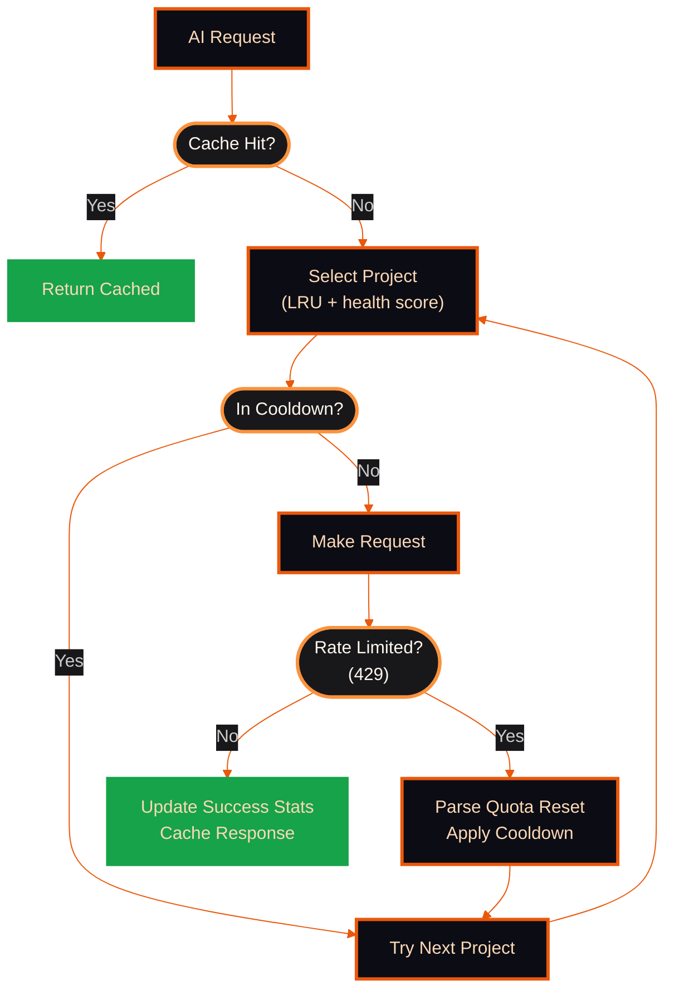

<div align="center">

```
   ██████  ███████ ██     ██  █████  ██████  ███    ███
  ██       ██      ██     ██ ██   ██ ██   ██ ████  ████
  ██   ███ ███████ ██  █  ██ ███████ ██████  ██ ████ ██
  ██    ██      ██ ██ ███ ██ ██   ██ ██   ██ ██  ██  ██
   ██████  ███████  ███ ███  ██   ██ ██   ██ ██      ██
```

### Free Gemini API Inference Gateway

Use Google's Gemini models for free through an OpenAI-compatible API.
Pool multiple Gmail accounts to multiply your free-tier quota.


</div>

---

## What is GSwarm?

GSwarm is an OpenAI-compatible API proxy that routes requests through Google's free CloudCode PA endpoint — the same backend used by Gemini CLI. It pools multiple Google accounts and rotates across their GCP projects to maximize free-tier throughput.

**With 3 free Gmail accounts (36 GCP projects), you get:**

| Model | Requests/Min | Requests/Day | Per Account |
|-------|-------------|-------------|-------------|
| Gemini 2.5 Flash | ~250 RPM | ~5,000 RPD | ~1,680/acc |
| Gemini 2.5 Pro | ~130 RPM | ~211 RPD | ~70-80/acc |
| Gemini 3 Flash Preview | ~300 RPM | ~5,880 RPD | ~1,960/acc |
| Gemini 3 Pro Preview | — | ~210 RPD | ~70-80/acc |

## Quick Example

```bash
curl http://localhost:3001/v1/chat/completions \
  -H "Content-Type: application/json" \
  -H "Authorization: Bearer sk-gswarm-your-key" \
  -d '{
    "model": "gemini-2.5-flash",
    "messages": [{"role": "user", "content": "Hello!"}]
  }'
```

Works with any OpenAI-compatible client — Cursor, Continue, Open WebUI, LangChain, etc.

## Standalone Version

Don't need the full dashboard? Use the single-file Python version:

```bash
# Download and run
python gswarm-standalone.py

# Benchmark your setup
python gswarm-standalone.py bench --model gemini-3-pro-preview --duration 60 --rpm 60
```

**[Get gswarm-standalone.py](https://gist.github.com/bosmadev/96650e6df30f77281aa1f4e399289d3d)**

---

## Architecture


**How it works:**

1. **Request arrives** at `/v1/chat/completions` (OpenAI-compatible)
2. **LRU selector** picks the healthiest project (success rate + cooldown scoring)
3. **Token manager** provides a valid OAuth token (auto-refresh)
4. **Request proxied** to Google's CloudCode PA endpoint
5. **On 429/error** — automatic failover to next project/account

---

## LRU Project Rotation

GSwarm uses **Least Recently Used (LRU)** project rotation with health scoring to maximize throughput and avoid rate limits.



### Project Status Tracking

Each project tracks comprehensive health metrics:

```typescript
interface ProjectStatus {
  id: string;
  lastUsedAt: number;
  lastSuccessAt: number;
  lastErrorAt: number;
  successCount: number;
  errorCount: number;
  consecutiveErrors: number;
  cooldownUntil: number;
  lastErrorType?: "rate_limit" | "auth" | "server" | "quota_exhausted";
  quotaResetTime?: number;      // Parsed from 429 response
  quotaResetReason?: string;    // Human-readable (e.g., "21h10m20s")
}
```

**Selection algorithm:**

1. Filter out projects in cooldown (`cooldownUntil > now`)
2. Score remaining projects: `successCount / (errorCount + 1)`
3. Pick least-recently-used project with highest success rate
4. Fallback to next project on error (automatic retry)

---

## Rate Limits & Quotas

### Google Cloud Companion API Quotas

**Per-minute quotas:**

| API Endpoint | Limit |
|--------------|-------|
| Code Repository Index Management | 600 req/min |
| Anarres API (per user) | 100 req/min |
| API Requests (per user) | 120 req/min |
| Data Insights API (per user) | 120 req/min |
| Generate Looker Query (per user) | 100 req/min |

**Per-day quotas (per user):**

| API Endpoint | Limit | GSwarm Capacity (3 acc × 12 proj) |
|--------------|-------|----------------------------------|
| Chat API | 1,500 req/day | ~54,000 req/day |
| Code API | 4,500 req/day | ~162,000 req/day |
| Duet Complete Code API | 4,500 req/day | ~162,000 req/day |
| Duet Generate Code API | 4,500 req/day | ~162,000 req/day |
| Duet Task API | 720 req/day | ~25,920 req/day |
| Duet Text API | 180 req/day | ~6,480 req/day |

**System limits:**

- **Code Repository Index:** 1 per project (multi-repo orgs need separate projects)

### Tested Throughput (December 2025)

Config: **3 Gmail accounts × 12 projects = 36 rotation slots**

| Model | RPM | RPD | Per Account |
|-------|-----|-----|-------------|
| Gemini 2.5 Flash | ~250 | ~5,000 | ~1,680 |
| Gemini 2.5 Pro | ~130 | ~211 | ~70-80 |
| Gemini 3 Flash Preview | ~300 | ~5,880 | ~1,960 |
| Gemini 3 Pro Preview* | — | ~210 | ~70-80 |

*Requires Google AI Pro subscription ($20/month)

**Note:** Each model has separate quotas per account per day — exhausting Flash quota doesn't affect Pro quota.

---

## Cooldown & Error Handling

### Cooldown Configuration

GSwarm applies intelligent cooldowns based on error type:

| Error Type | Cooldown | Strategy |
|------------|----------|----------|
| Rate Limit (429) | Until quota reset | Parse reset time from response, fallback to 120s |
| Auth (401/403) | 300s (5 min) | Token refresh needed |
| Server (5xx) | 60s (1 min) | Transient error |
| Minimum Cooldown | 120s (2 min) | Safety floor |

### Health States

GSwarm tracks system-wide health across 5 states:

```typescript
type GSwarmStatus =
  | "connected"           // All projects available
  | "degraded-routed"     // Some 429'd but fallback succeeded
  | "degraded-capacity"   // Some projects unavailable
  | "frozen"              // Account-wide cooldown active
  | "disconnected"        // All accounts exhausted
  | "quota_exhausted";    // Daily quota exhausted
```

**State transitions:**

- **connected → degraded-routed:** Some projects rate-limited, but request succeeded on fallback
- **connected → degraded-capacity:** Multiple projects unavailable, capacity reduced
- **degraded-* → frozen:** Account-wide cooldown triggered (e.g., billing disabled)
- **frozen → disconnected:** All accounts exhausted or frozen

### Error Handler Namespace

Redis pubsub channel: `gswarm:error`

```typescript
await redis.publish("gswarm:error", {
  type: "rate_limit" | "auth" | "server" | "quota_exhausted",
  projectId: string,
  accountEmail: string,
  message: string,
  cooldownUntil: number,
  quotaResetTime?: number,
});
```

---

## Monitoring

### Redis Keys

GSwarm stores project status and metrics in Redis for real-time monitoring:

| Key Pattern | Purpose |
|-------------|---------|
| `gswarm:status` | Global health state (connected/degraded/frozen/disconnected) |
| `gswarm:project:{id}:status` | Per-project status (lastUsedAt, successCount, cooldownUntil) |
| `gswarm:account:{email}:status` | Per-account health (frozenUntil, failedProjects) |
| `gswarm:cache:{hash}` | AI response cache (TTL varies by call source) |
| `gswarm:news` | News cache (TTL: 5 min) |
| `gswarm:seen_ids` | Seen news IDs (deduplication) |
| `gswarm:error` | Error pubsub channel (broadcasts rate limits, auth failures) |

### Metrics Interface

```typescript
interface GSwarmMetrics {
  totalRequests: number;
  successfulRequests: number;
  failedRequests: number;
  rateLimitedRequests: number;
  authFailedRequests: number;
  serverErrorRequests: number;
  cacheHits: number;
  cacheMisses: number;
  averageLatencyMs: number;
  projectRotations: number;
}
```

**Dashboard endpoint:** `/api/gswarm/metrics` (authenticated)

---

## Setup

### 1. Install & Configure

```bash
git clone https://github.com/bosmadev/gswarm.git
cd gswarm
pnpm install
```

### 2. Environment

Create a `.env` file (encrypted via [dotenvx](https://dotenvx.com)):

```bash
# Admin credentials (fallback if Redis is unavailable)
ADMIN_USERNAME=admin
ADMIN_PASSWORD=your-secure-password

# API Keys (format: name:key:ips — use * for all IPs)
API_KEYS=myapp:sk-gswarm-xxxxx:*

# Application
GLOBAL_PORT=3001
GLOBAL_URL=http://localhost

# Session Secret (generate: openssl rand -base64 32)
SESSION_SECRET=your-session-secret

# Redis — any Redis-compatible service works
# Upstash (free): https://upstash.com/pricing/redis
# Self-hosted: redis://localhost:6379
REDIS_URL=redis://localhost:6379
```

Encrypt with `pnpm env:encrypt` before committing.

### 3. Run

```bash
pnpm dev          # Development (Turbopack)
pnpm launch       # Interactive TUI launcher
pnpm build        # Production build
```

### 4. Add Accounts

Open the dashboard at `http://localhost:3001/dashboard`, log in, and click **Add Account** to connect Gmail accounts via OAuth. Each account gives you 12 GCP projects for rotation.

---

## Supported Models

| Model | ID |
|-------|-----|
| Gemini 2.5 Flash | `gemini-2.5-flash` |
| Gemini 2.5 Pro | `gemini-2.5-pro` |
| Gemini 3 Flash Preview | `gemini-3-flash-preview` |
| Gemini 3 Pro Preview | `gemini-3-pro-preview` |
| Gemini 2.0 Flash | `gemini-2.0-flash` |

---

## Stack

| Component | Technology |
|-----------|-----------|
| Framework | Next.js 16 (App Router) |
| Language | TypeScript 5.9 |
| Storage | Redis (Upstash / self-hosted) |
| Auth | Google OAuth 2.0 |
| Linting | Biome |
| Testing | Vitest + Pytest |

---

## Contributing

See [CONTRIBUTING.md](.github/CONTRIBUTING.md) for the fork-based workflow.

PRs target `main`. Run `pnpm validate` before submitting.

---

## License

**AGPL-3.0** — See [LICENSE](./LICENSE)

| Permitted | Required | Restricted |
|-----------|----------|-----------|
| Commercial use | Disclose source | Closed-source mods |
| Modification | Same license | Proprietary SaaS |
| Distribution | Network use = distribution | |
| Private use | Copyright notice | |
