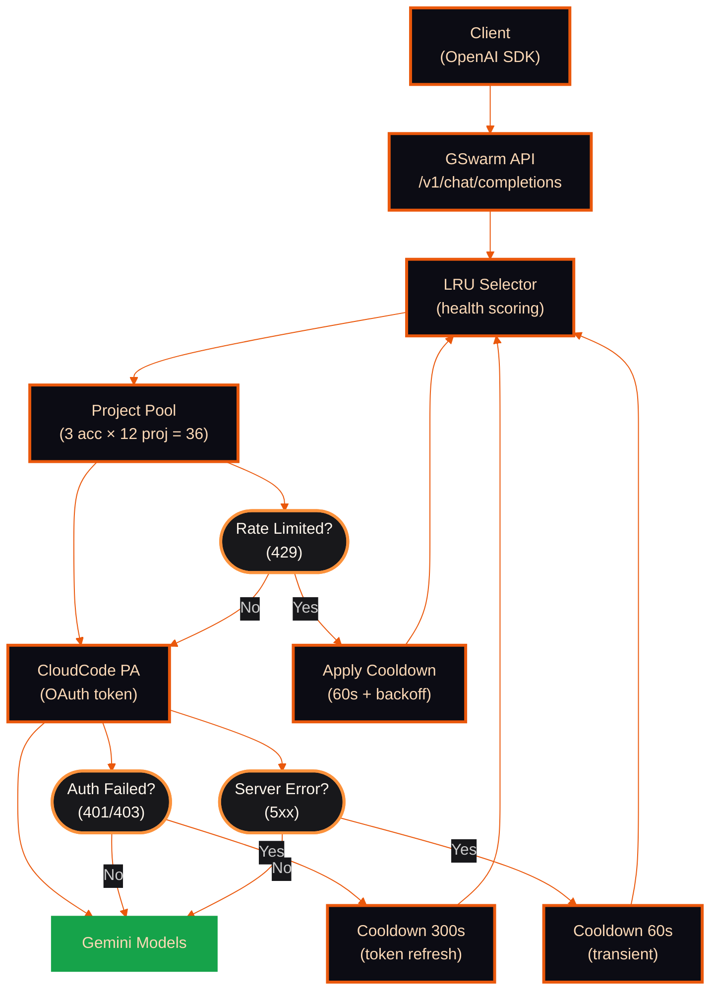

<div align="center">

```
   ██████  ███████ ██     ██  █████  ██████  ███    ███
  ██       ██      ██     ██ ██   ██ ██   ██ ████  ████
  ██   ███ ███████ ██  █  ██ ███████ ██████  ██ ████ ██
  ██    ██      ██ ██ ███ ██ ██   ██ ██   ██ ██  ██  ██
   ██████  ███████  ███ ███  ██   ██ ██   ██ ██      ██
```

### Free Gemini API Inference Gateway

Use Google's Gemini models for free through an OpenAI-compatible API.
Pool multiple Gmail accounts to multiply your free-tier quota.


</div>

---

## What is GSwarm?

GSwarm is an OpenAI-compatible API proxy that routes requests through Google's free CloudCode PA endpoint — the same backend used by Gemini CLI. It pools multiple Google accounts and rotates across their GCP projects to maximize free-tier throughput.

**With 3 free Gmail accounts (36 GCP projects), you get:**

| Model | Requests/Min | Requests/Day | Per Account |
|-------|-------------|-------------|-------------|
| Gemini 2.5 Flash | ~250 RPM | ~5,000 RPD | ~1,680/acc |
| Gemini 2.5 Pro | ~130 RPM | ~211 RPD | ~70-80/acc |
| Gemini 3 Flash Preview | ~300 RPM | ~5,880 RPD | ~1,960/acc |
| Gemini 3 Pro Preview* | — | ~210 RPD | ~70-80/acc |

\*Requires Google AI Pro subscription ($20/mo)

Each model has separate quotas per account per day — exhausting Flash quota doesn't affect Pro quota.

## Quick Example

```bash
curl http://localhost:3000/v1/chat/completions \
  -H "Content-Type: application/json" \
  -H "Authorization: Bearer sk-gswarm-your-key" \
  -d '{
    "model": "gemini-2.5-flash",
    "messages": [{"role": "user", "content": "Hello!"}]
  }'
```

Works with any OpenAI-compatible client — Cursor, Continue, Open WebUI, LangChain, etc.

## Standalone Version

Don't need the full dashboard? Use the single-file Python version:

```bash
# Download and run
python gswarm-standalone.py

# Benchmark your setup
python gswarm-standalone.py bench --model gemini-3-pro-preview --duration 60 --rpm 60
```

**[Get gswarm-standalone.py](https://gist.github.com/bosmadev/96650e6df30f77281aa1f4e399289d3d)**

---

## Architecture



**How it works:**

1. **Request arrives** at `/v1/chat/completions` (OpenAI-compatible)
2. **LRU selector** picks the healthiest project (composite health scoring)
3. **Token manager** provides a valid OAuth token (auto-refresh)
4. **Request proxied** to Google's CloudCode PA endpoint
5. **On 429/error** — automatic failover to next project/account

---

## API Endpoints

| Method | Endpoint | Auth | Description |
|--------|----------|------|-------------|
| POST | `/v1/chat/completions` | API Key | OpenAI-compatible chat completions |
| POST | `/api/gswarm/generate` | API Key | Direct Gemini generation |
| POST | `/api/gswarm/chat` | API Key | Multi-turn chat |
| GET | `/api/gswarm/status` | API Key / Session | System health |
| GET | `/api/gswarm/accounts` | API Key / Session | OAuth accounts list |
| POST | `/api/gswarm/accounts/{email}/discover-projects` | API Key / Session | Discover GCP projects |
| GET | `/api/gswarm/models` | API Key / Session | Available models (filterable) |
| GET | `/api/gswarm/metrics` | API Key / Session | Usage metrics |
| GET/POST | `/api/gswarm/config` | API Key | Read/update GSwarm config |
| GET | `/api/gswarm/status/stream` | API Key | SSE real-time status |
| GET | `/api/gswarm/metrics/export` | API Key / Session | Export metrics ZIP/CSV/JSON |
| GET | `/api/gswarm/metrics/trends` | API Key / Session | Historical trend analysis |
| GET | `/api/dashboard/stats` | Session | Dashboard overview stats |
| GET | `/api/dashboard/metrics` | Session | Dashboard chart data |
| GET | `/api/dashboard/errors` | Session | Error log |
| POST | `/api/admin/login` | — | Admin login |
| POST | `/api/admin/logout` | Session | Admin logout |
| GET | `/api/admin/session` | Session | Session validation |
| GET | `/api/auth/google` | — | OAuth redirect |
| GET | `/api/auth/callback` | — | OAuth callback |
| POST | `/api/auth/login` | — | Auth login |
| POST | `/api/auth/logout` | Session | Auth logout |
| GET | `/api/api-keys` | Session | List API keys |
| POST | `/api/api-keys` | Session | Create API key |
| DELETE | `/api/api-keys/{id}` | Session | Delete API key |
| GET | `/api/accounts` | Session | List accounts (dashboard) |
| POST | `/api/accounts/{id}/logout` | Session | Logout account |
| GET | `/api/projects` | Session | List projects |
| POST | `/api/projects/create` | Session | Create project |
| POST | `/api/projects/test` | Session | Test all projects |
| POST | `/api/projects/{id}/enable` | Session | Enable project |
| POST | `/api/projects/{id}/test` | Session | Test single project |
| POST | `/api/projects/{id}/toggle` | Session | Toggle project |
| POST | `/api/bench` | Session | Run benchmark |
| POST | `/api/probe` | Session | Probe endpoint |
| GET | `/api/refresh-tokens` | Session | Refresh OAuth tokens |

---

## LRU Project Rotation

GSwarm uses **Least Recently Used (LRU)** project rotation with health scoring to maximize throughput and avoid rate limits.


### Project Status Tracking

Each project tracks comprehensive health metrics (`lib/gswarm/types.ts`):

```typescript
interface ProjectStatus {
  projectId: string;
  lastUsedAt: number;
  lastSuccessAt: number;
  lastErrorAt: number;
  successCount: number;
  errorCount: number;
  consecutiveErrors: number;
  cooldownUntil: number;
  lastErrorType?: "rate_limit" | "auth" | "server" | "not_logged_in" | "quota_exhausted";
  quotaResetTime?: number;      // Parsed from 429 response
  quotaResetReason?: string;    // Human-readable (e.g., "21h10m20s")
}
```

### Health Score Formula

Projects are ranked by a weighted composite score (`lib/gswarm/lru-selector.ts`):

```
score = 0.5 × successRate + 0.3 × recencyBonus + 0.2 × (1 - cooldownPenalty)
```

| Component | Weight | Range | Description |
|-----------|--------|-------|-------------|
| Success Rate | 0.5 | 0-1 | `successCount / (successCount + errorCount)` |
| Recency Bonus | 0.3 | 0-1 | Linear decay over 5-minute window |
| Cooldown Penalty | 0.2 | 0-1 | 1 if in cooldown, 0 otherwise |

**Selection algorithm:**

1. Evaluate all enabled projects across all accounts
2. Calculate composite health score for each
3. Sort by health score (highest first)
4. Return best project with its account's OAuth token
5. Fallback to next project on error (automatic retry)

---

## Cooldown & Error Handling

### Cooldown Configuration

GSwarm applies exponential backoff cooldowns based on error type (`lib/gswarm/storage/projects.ts`):

| Parameter | Value |
|-----------|-------|
| Initial cooldown | 60s (1 min) |
| Max cooldown | 3,600s (1 hour) |
| Backoff multiplier | 2x |
| Consecutive error threshold | 3 (before backoff kicks in) |

**Rate limit (429):** Parses quota reset time from response body (e.g., "21h10m20s"), falls back to 60s initial cooldown.

**Auth errors (401/403):** Default 300s cooldown for token refresh.

**Server errors (5xx):** Standard exponential backoff from 60s.

### Health States

GSwarm tracks system-wide health (`lib/gswarm/types.ts`):

```typescript
type GSwarmStatus =
  | "connected"           // All projects available
  | "degraded-routed"     // Some 429'd but fallback succeeded
  | "degraded-capacity"   // Some projects unavailable
  | "frozen"              // Account-wide cooldown active
  | "disconnected"        // All accounts exhausted
  | "quota_exhausted";    // Daily quota exhausted
```

---

## Monitoring

### Redis Keys

GSwarm uses Redis for all persistent storage:

| Key Pattern | Purpose |
|-------------|---------|
| `gswarm:api-keys` | API key store (name, hash, IP allowlist) |
| `gswarm:rate-limit:{keyHash}:{minute}` | Per-key per-minute rate limit counters |
| `project-status:{projectId}` | Per-project health (successCount, cooldownUntil, errors) |
| `oauth-tokens:{email}` | OAuth tokens per Google account (access + refresh) |
| `metrics:{YYYY-MM-DD}` | Daily request metrics with 30-day TTL |

### Metrics Types

Request-level and aggregated metrics (`lib/gswarm/types.ts`):

```typescript
interface RequestMetric {
  id: string;
  timestamp: string;
  endpoint: string;
  method: string;
  account_id: string;
  project_id: string;
  duration_ms: number;
  status: "success" | "error";
  status_code?: number;
  error_type?: string;
  tokens_used?: number;
  model?: string;
}

interface AggregatedMetrics {
  period_start: string;
  period_end: string;
  total_requests: number;
  successful_requests: number;
  failed_requests: number;
  avg_duration_ms: number;
  total_duration_ms: number;
  by_endpoint: Record<string, EndpointStats>;
  by_account: Record<string, AccountStats>;
  by_project: Record<string, ProjectStats>;
  error_breakdown: Record<string, number>;
}
```

**Dashboard endpoint:** `GET /api/gswarm/metrics` (authenticated)

---

## Contributing

See [CONTRIBUTING.md](.github/CONTRIBUTING.md) for the fork-based workflow.

PRs target `main`. Run `pnpm validate` before submitting.

---

## License

**AGPL-3.0** — See [LICENSE](./LICENSE)

| Permitted | Required | Restricted |
|-----------|----------|-----------|
| Commercial use | Disclose source | Closed-source mods |
| Modification | Same license | Proprietary SaaS |
| Distribution | Network use = distribution | |
| Private use | Copyright notice | |
